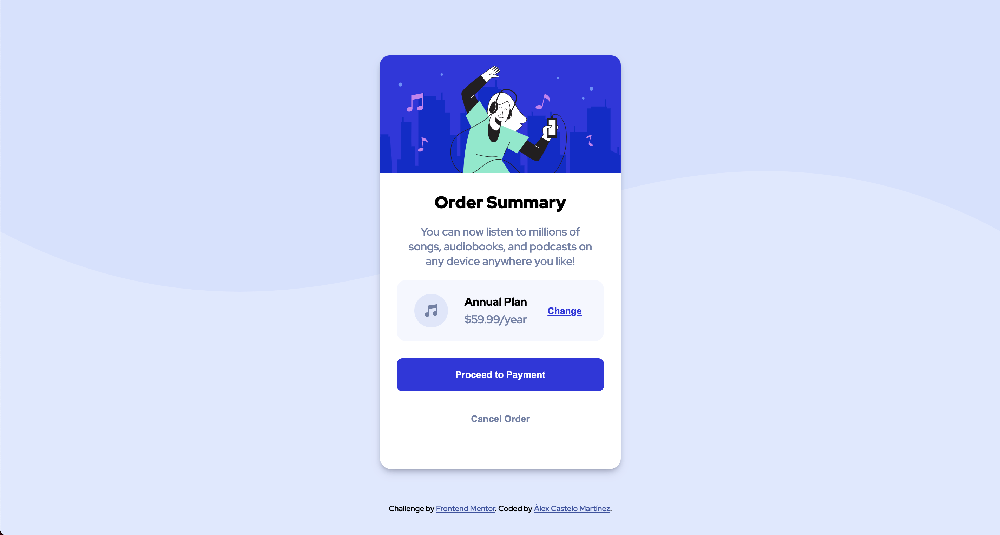

# Frontend Mentor - Order summary component solution

This is a solution to the [[Order summary component] challenge on Frontend Mentor](). Frontend Mentor challenges help you improve your coding skills by building realistic projects. 

## Table of contents

- [Overview](#overview)
  - [The challenge](#the-challenge)
  - [Screenshot](#screenshot)
  - [Links](#links)
- [My process](#my-process)
  - [Built with](#built-with)
  - [Continued development](#continued-development)
  - [Useful resources](#useful-resources)
- [Author](#author)
## Overview

### The challenge

The challenge is to build out this order summary card component and get it looking as close to the design as possible.

### Screenshot

### Links

- Solution URL: [Add solution URL here](https://github.com/alex-castelo/frontend-mentor-order-summary-component)
- Live Site URL: [Add live site URL here](https://alex-castelo.github.io/frontend-mentor-order-summary-component/)

## My process

### Built with

- Semantic HTML5 markup
- CSS BEM architecture
- Flexbox
- Mobile-first workflow

### Useful resources

- [Flexbox](https://css-tricks.com/snippets/css/a-guide-to-flexbox/) - Complete guide of Flexbox.
- [BEM](http://getbem.com/) - CSS BEM architecture.

## Author

- Frontend Mentor - [@alex-castelo](https://www.frontendmentor.io/profile/alex-castelo)
- Twitter - [@jove_nai](https://twitter.com/jove_nai)